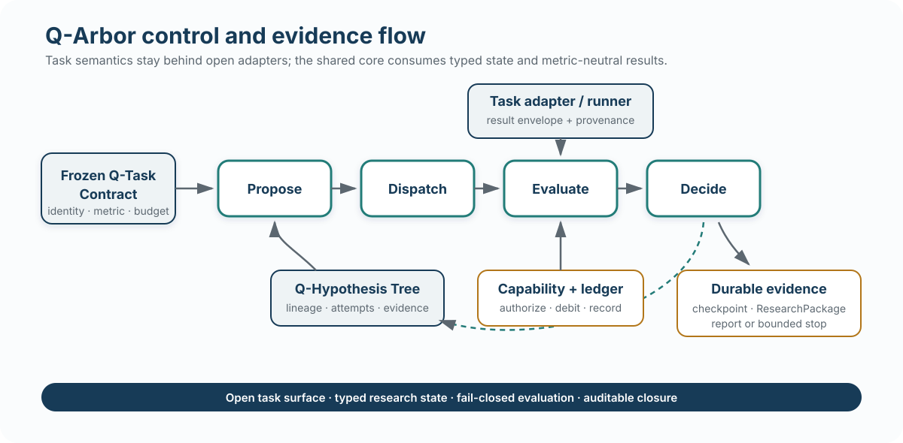
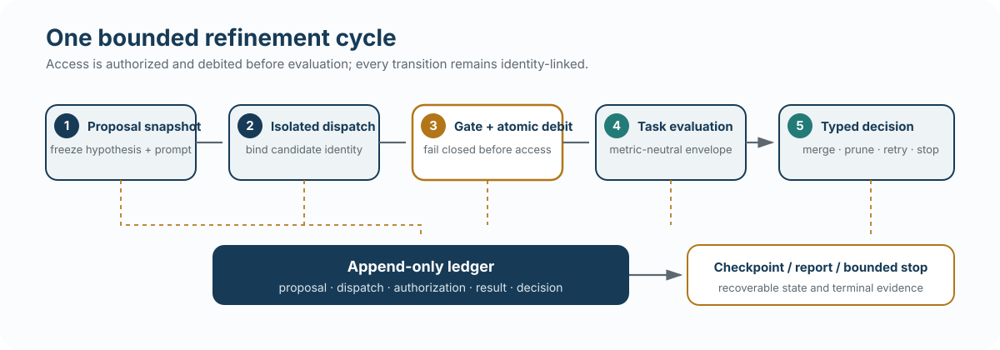

# Q-Arbor

Q-Arbor is a task-neutral research harness for stateful, bounded and auditable quantitative experimentation. It adapts Arbor's persistent Coordinator/Executor workflow to quantitative tasks through open adapter, runner, evaluation-stage, result and provenance interfaces.

Status: **v0.1 public release**.

<p align="center">
  <a href="https://github.com/hu-jy23/Q-Arbor/releases/tag/v0.1.0"></a>
  
  
  <a href="LICENSE"></a>
</p>

<p align="center">
  
</p>

## Core capabilities

- **Q-Task Contract** freezes task, data-role, metric, budget and provenance identity.
- **Q-Hypothesis Tree** stores typed hypotheses, attempts, evidence, failures and lineage.
- **Q-Refinement** runs a bounded `propose → dispatch → evaluate → decide` cycle.
- **Open evaluation surface** keeps task and platform semantics outside the shared core.
- **Capability firewall and ledger** gate evaluation and debit query budgets before access.
- **Recovery and reporting** preserve identity across interruption and terminal closure.

The core has no competition-name branches, platform-name branches, fixed task-type enumeration or fixed OOS-stage enumeration.

## Install

Q-Arbor requires Python 3.11 or newer.

```bash
python -m venv .venv
.venv/bin/pip install -e '.[test]'
```

Contract operations:

```bash
q-arbor-contract freeze tests/fixtures/contracts/valid_contract.json --output frozen.json
q-arbor-contract validate frozen.json
q-arbor-contract show-hash frozen.json
```

Run the public verification suite:

```bash
.venv/bin/python -m pytest
```

## Architecture

Task adapters translate opaque candidates into task-local invocations. Runners execute those invocations and return integrity-bound receipts. The shared core consumes metric-neutral result envelopes through an open stage policy, then records a typed decision and provenance chain.

<p align="center">
  
</p>

See [Architecture](docs/ARCHITECTURE.md) for the component and lifecycle map.

## Evaluation

Q-Arbor was evaluated through [QArborBench](https://github.com/hu-jy23/QArborBench), a seven-task benchmark spanning five representative quantitative task families and three primary evidence regimes. Every published cell contains complete Native, Flat Agent and Q-Arbor results.

The release covers Bike, Hull, JPX, Recruit, Walmart, Optiver and Web Traffic.

Frozen primary results:

- Q-Arbor vs Native: 5 wins, 2 losses.
- Q-Arbor vs Flat Agent: 4 wins, 3 losses.
- Public validation, Q-Arbor vs Flat Agent: 3 wins in 4 cells.

These are task-dependent results from one formal run per arm. They do not establish universal superiority, statistical score stability, a pure same-model component ablation, trading profitability or exact provider cost.

## Public repository boundary

This repository contains the installable product, schemas and stable source verification tests. Benchmark task contracts, accepted results and benchmark governance live in QArborBench.

It excludes raw data, hidden labels, protected evaluator/selector implementations, experiment sessions, prompts, attempts, ledgers, smoke outputs, caches, build products and paper files. See [Security and data boundary](SECURITY.md).

## License

Apache License 2.0. See [LICENSE](LICENSE).
